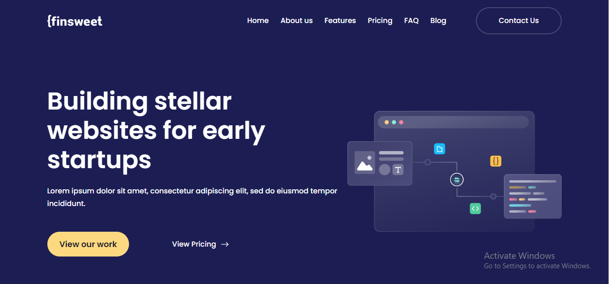
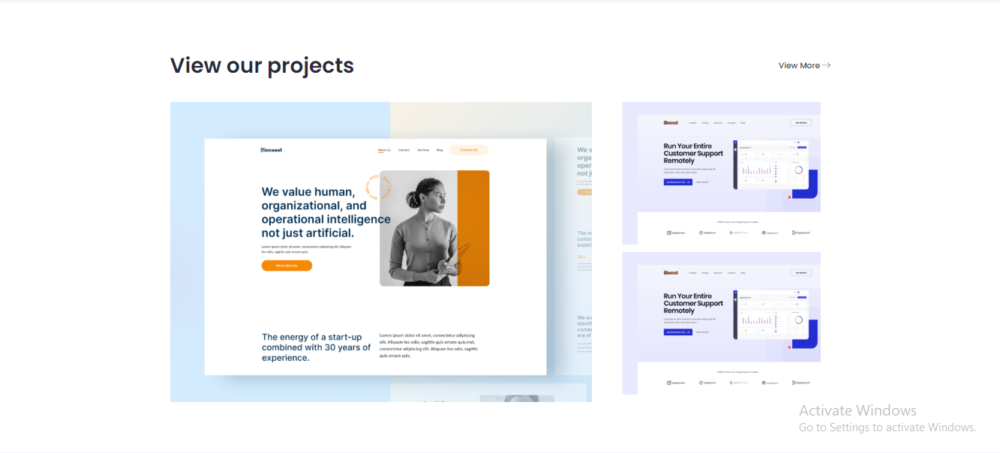
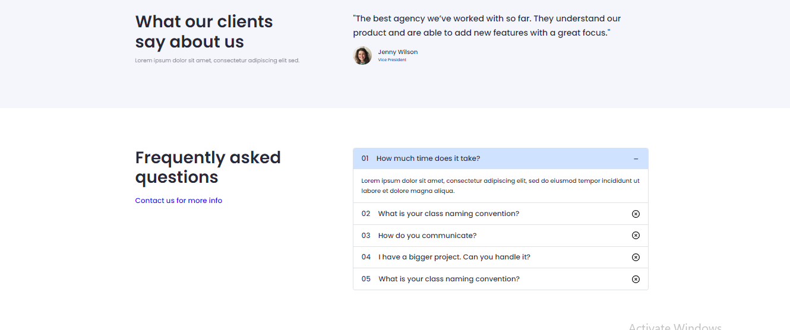
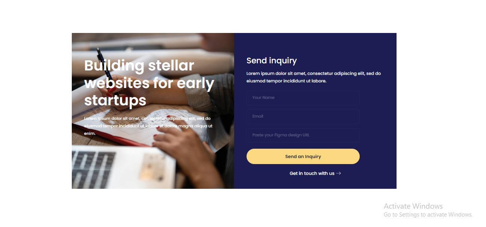
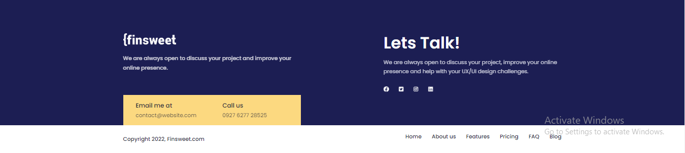

# Finsweet

# ✨ Finsweet Project details:

### 🧨Here is the live link and screenshot of Finsweet project by clicking on the image you will redirect to my github upload and others screenshot will redirect to code:

  

  

  

  

  

